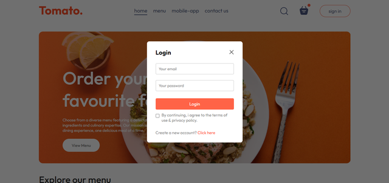
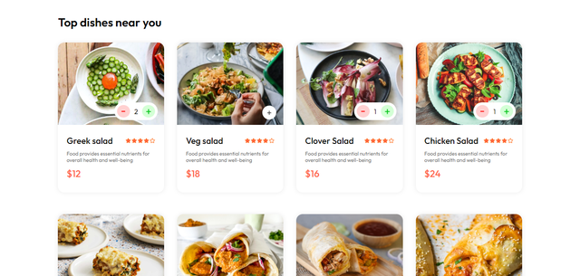

# Introduction to the project

- This is a simple e-commerce website where you can order food items similar to that of Zomato. This project is built using MERN stack. The frontend is built using React.js and the backend is built using Node.js and Express.js. The database used in this project is MongoDB.

# Files and Folders

- The frontend of the project is in frontend folder and the backend of the project is in backend folder. admin folder contains the admin panel of the project.

# How to run the project

- First clone the project using the following command:
```
git clone
```

- Then go to the backend folder and run the following command to install the dependencies:
```
npm install
```

- Then run the following command to start the backend server:
```
npm run server
```

- Then go to the frontend folder and run the following command to install the dependencies:
```
npm install
```

- Then run the following command to start the frontend server:
```
npm start
```

- Now the project will run on the following URL:
```
http://localhost:3000/
```

- To run the admin panel, go to the admin folder and run the following command to install the dependencies:
```
npm install
```

- Then run the following command to start the admin panel:
``` 
npm start
```

# Features of the project

## User Features

- User can register/login.
- User can view all the food items.
- User can view the details of a food item.
- User can add a food item to the cart.
- User can view the cart.
- User can remove a food item from the cart.
- User can place an order.
- User can view all the orders.

## Admin Features

- Admin can view all the food items.
- Admin can add a food item.
- Admin can edit a food item.
- Admin can delete a food item.
- Admin can view all the orders.
- Admin can view a specific order.
- Admin can change the status of an order.

# Demo of the project

- Some screenshots of the project are shown below:

## Home Page


## Authentication Page



## Food Items Page



# Author

- Yashaswi Pasumarthy

# Notes

- The project is still under development. I will be adding more features to the project in the future.
- The frontend url is hardcoded in the backend. So, make sure to change the frontend url in the backend before running the project. This change is to be done in the orderController.js file in the backend.
- This project is built for educational purposes only.
